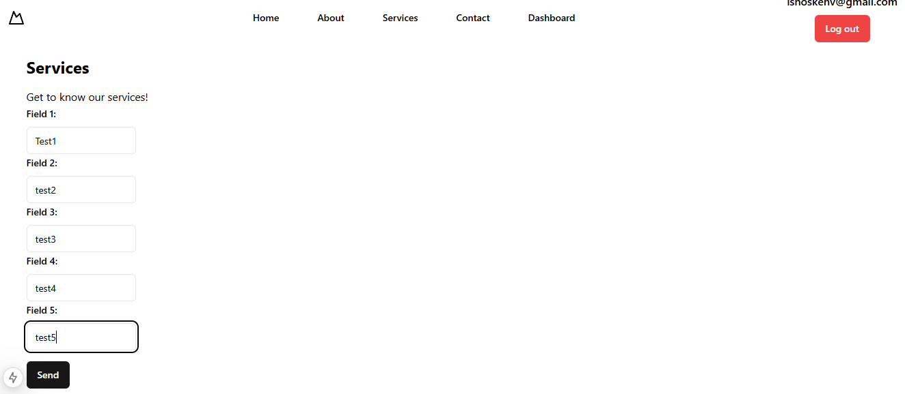
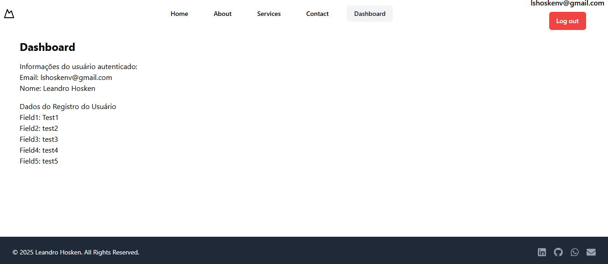
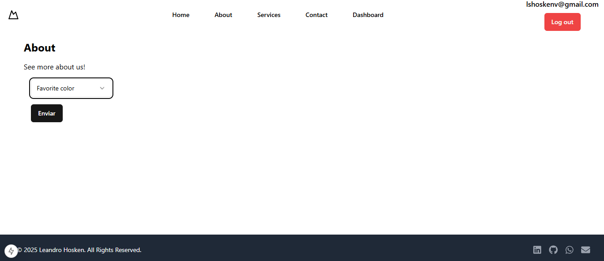

 

[English](#personal-project-next-prisma---24) | [Português](#projeto-pessoal-next-prisma---24) | [Images](#images)  

# Personal Project Next Prisma - 24

This personal project aims to enhance my skills with Next.js and Shadcn UI, while also introducing me to Prisma for advanced database management and user-side data manipulation.  

## ✔️ Techniques and technologies used  
- **HTML/CSS**: Used for markup and styling.  
- **TypeScript**: Used to add static typing to JavaScript, increasing code security.  
- **NEXT.js**: Framework used for rendering static and dynamic pages with excellent performance.  
- **Next.js Pagination**: Implemented to organize and display data across multiple pages.  
- **Environment Variable**: Created to protect API keys used in the project.  
- **Shadcn UI**: Used to create modern and visually appealing components like Navbar, Forms, Input, and Button.  
- **Tailwind.css**: Employed for styling and building responsive layouts efficiently.  
- **Git/GitHub**: Tools used for version control and code hosting.  
- **Vercel**: Platform used to publish and host the project.  
- **Kinde**: Used to implement and configure user authentication.  
- **Middleware**: Used a middleware setup with Kinde to protect routes.  
- **Prisma**: Utilized for robust database management and ORM integration.  
- **Prisma Schema (schema.prisma)**: Defines the data models and relationships in the project’s database.  
- **Prisma API Routing**: Configures API endpoints to enable backend communication with the database through Prisma.  
- **Prisma Front-end Component**: Provides a user interface for interacting with and managing data seamlessly.  
 

## ⚠️ Challenges  
  Ensuring that each user had only one row required significant effort. Additionally, users could modify any of the five fields, with only the fields they altered being updated in the Prisma database.

    

---

# Projeto Pessoal Next Prisma - 24

Este projeto pessoal tem como objetivo aprimorar minhas habilidades com Next.js e Shadcn UI, ao mesmo tempo em que me apresenta ao Prisma para o gerenciamento avançado de banco de dados e manipulação de dados pelo usuário.  

## ✔️ Técnicas e tecnologias utilizadas  
- **HTML/CSS**: Utilizado para marcação e estilização.  
- **TypeScript**: Utilizado para adicionar tipagem estática ao JavaScript, aumentando a segurança do código.  
- **NEXT.js**: Framework utilizado para renderizar páginas estáticas e dinâmicas com desempenho excelente.  
- **Next.js Pagination**: Implementado para organizar e exibir dados em várias páginas.  
- **Variável de Ambiente**: Criada para proteger as chaves de API utilizadas no projeto.  
- **Shadcn UI**: Utilizado para criar componentes modernos e visualmente atraentes, como Navbar, Formulários, Input e Botão.  
- **Tailwind.css**: Utilizado para estilização e construção de layouts responsivos de forma eficiente.  
- **Git/GitHub**: Ferramentas utilizadas para controle de versão e hospedagem de código.  
- **Vercel**: Plataforma utilizada para publicar e hospedar o projeto.  
- **Kinde**: Utilizado para implementar e configurar a autenticação de usuários.  
- **Middleware**: Utilizado um middleware configurado com o Kinde para proteger as rotas.  
- **Prisma**: Utilizado para gerenciamento robusto de banco de dados e integração ORM.  
- **Prisma Schema (schema.prisma)**: Define os modelos de dados e os relacionamentos no banco de dados do projeto.  
- **Prisma API Routing**: Configura endpoints de API para possibilitar a comunicação entre o backend e o banco de dados via Prisma.  
- **Prisma Front-end Component**: Fornece uma interface de usuário para interagir com e gerenciar os dados de forma fluida.  
 

## ⚠️ Desafios  
Garantir que cada usuário tivesse apenas uma linha exigiu um esforço significativo. Além disso, os usuários poderiam modificar qualquer um dos cinco campos, sendo que apenas os campos alterados seriam atualizados no banco de dados Prisma.

---

## Images

  
  
  

